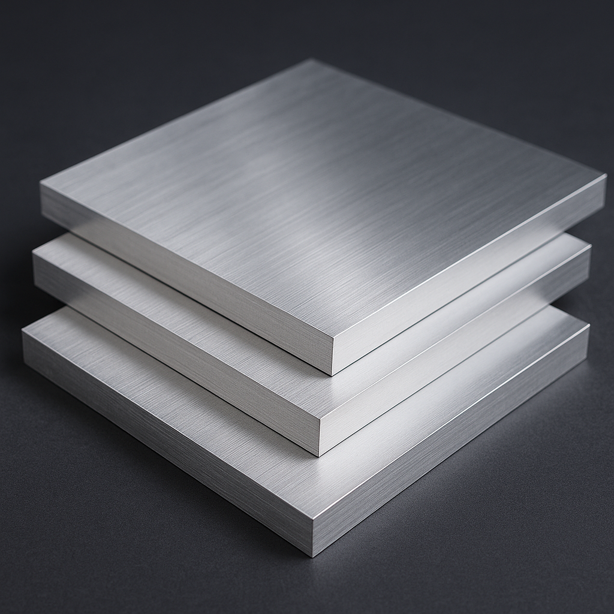

<!DOCTYPE html>
<html lang="id">
<head>
  <meta charset="UTF-8" />
  <meta name="viewport" content="width=device-width, initial-scale=1.0" />
  <title>Toko Aluminium & Baut Mur</title>
  <link rel="stylesheet" href="toko2.css" />
</head>
 
<body>
  <header>
    

      
      <a href="toko2.html"> Barokah Aluminium</a>
    
    

    <nav>
      <a href="toko2.html">Beranda</a>
      <a href="halproduk.html">Produk</a>
      <a href="tentang.html">Tentang Kami</a>
      <a href="kontak.html">Kontak</a>
    </nav>
  </header>

  <section class="hero">
  

    

    

    

    <!-- Tombol manual -->
    <button class="slide-btn prev">&#10094;</button>
    <button class="slide-btn next">&#10095;</button>
  

  

    <h1>Solusi Kuat untuk Konstruksi Anda</h1>
    

      <a href="#produk" class="btn btn-orange">Lihat Produk</a>
  

</section>

  <section id="produk" class="produk">
  <h2>Kategori Produk</h2>
  

    
    

      <a href="alumunium.html">
        
        
Alumunium

      </a>
    

     

      <a href="aksesoris.html">
        
        
Aksesoris

      </a>
    

    

      <a href="kaca.html">
        
        
Kaca

      </a>
    

    

      <a href="bautmur.html">
        
        
Baut Mur & Ring

      </a>
    

    

      <a href="jasa.html">
        
        
Jasa Pembuatan

      </a>
    

  

</section>

  <section id="katalog" class="keunggulan">
    <h2>Keunggulan Kami</h2>
    

      
📦 Stok Lengkap

      
🚚 Pengiriman Cepat

      
🛡️ Kualitas Terjamin

      
📞 Konsultasi Gratis

    

  </section>

  <section id="tentang" class="testimoni">
    <h2>Testimoni Pelanggan</h2>
    

      <blockquote>
        
Produk sangat berkualitas dan pengirimannya cepat!

        <cite>– Budi, Kontraktor</cite>
      </blockquote>
      <blockquote>
        
Langganan di sini karena lengkap dan responsif CS-nya.

        <cite>– Ivan, Bengkel Teknik</cite>
      </blockquote>
      <blockquote>
        
Ramah dan bisa di ajak konsultasi.

        <cite>– ahmad, Arsitek</cite>
      </blockquote>
    

  </section>

  <section id="kontak" class="kontak">
    <h2>Hubungi Kami</h2>
    <form id="kontakForm">
      <input type="text" id="nama" placeholder="Nama Lengkap" required>
      <input type="text" id="telepon" placeholder="Nomor Telepon" required>
      <textarea id="pesan" placeholder="Pesan Anda" rows="5" required></textarea>
      <button type="submit">Kirim Pesan</button>
    </form>
  </section>

 <footer>
  

    

      <h3>Toko Alumunium mur dan baut</h3>
     

  Barakah Aluminium menyediakan berbagai kebutuhan   aluminium,baut, mur, ring, dan aksesoris konstruksi 
  dengan standar kualitas tinggi dan pilihan terlengkap.  Kami berkomitmen menghadirkan produk unggulan 
  dengan harga yang kompetitif dan pelayanan yang ramah.  

  Baik Anda seorang kontraktor, tukang bangunan,  pemilik bengkel, ataupun individu  yang sedang membangun rumah impian, 
  kami siap membantu memenuhi kebutuhan material  Anda dengan cepat, aman, dan terpercaya.  

    

    

      <h4>Kontak</h4>
      
Email: barokahalumunium@gmail.com

      
Telp: 0831-0781-9553

      
Alamat: Barokah Alumunium Sukorejo, W27J+WJC,   Beteng, Tamping Winarno, Kec. Sukorejo,  Kabupaten Kendal, Jawa Tengah 51363

      <iframe src="https://www.google.com/maps/embed?pb=!1m18!1m12!1m3!1d4495.51367656415!2d110.02886707554148!3d-7.085188692917803!2m3!1f0!2f0!3f0!3m2!1i1024!2i768!4f13.1!3m3!1m2!1s0x2e706d0006cfc86d%3A0xa332a05c06d47529!2sBarokah%20Alumunium%20Sukorejo!5e1!3m2!1sen!2sid!4v1751735802469!5m2!1sen!2sid" width="500" height="350" style="border:0;" allowfullscreen="" loading="lazy" referrerpolicy="no-referrer-when-downgrade"></iframe>
    

    

      <h4>Ikuti Kami</h4>
      

        >
           Instagram
        </a> 
        >
           Facebook
        </a> 
        <a href="https://wa.me/6283107819553" target="_blank"style="color: inherit; text-decoration: none;">>
           WhatsApp
        </a>
      

    

  

  
© Copyright 2025 || Barakah Alumunium Sukorejo

</footer>

   
</body>
</html>
